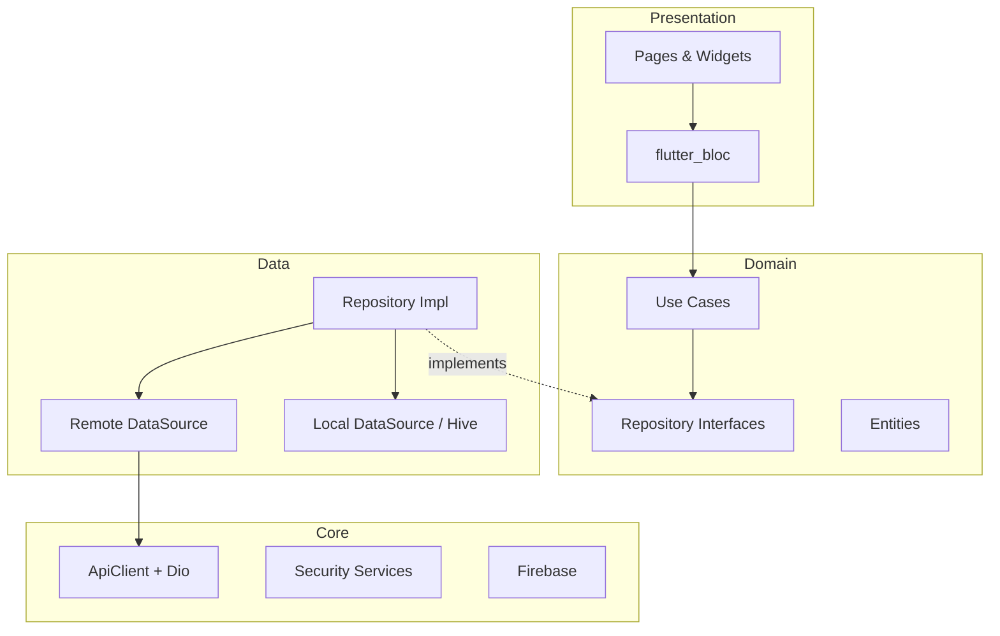

<p align="center">
  
</p>

<h1 align="center">BankX</h1>

<p align="center">
  <strong>Enterprise-grade digital banking for Flutter — Clean Architecture, offline-first, production-ready.</strong>
</p>

<p align="center">
  <a href="https://flutter.dev"></a>
  <a href="https://dart.dev"></a>
  <a href="LICENSE"></a>
  
  
  
  
  
  
  
</p>

<p align="center">
  <a href="#features">Features</a> •
  <a href="#screenshots">Screenshots</a> •
  <a href="#architecture">Architecture</a> •
  <a href="#installation">Installation</a> •
  <a href="#documentation">Documentation</a> •
  <a href="#contributing">Contributing</a>
</p>

---

## Overview

**BankX** is a production-grade digital banking application built with Flutter. It demonstrates how a senior engineering team would structure a regulated fintech product: feature-first Clean Architecture, JWT authentication, offline-capable transfers, QR payments, PDF statements, biometric security, and full CI/CD automation.

> **Disclaimer:** BankX is an open-source portfolio and interview showcase. It is not affiliated with any real financial institution and does not process real money.

## Features

| Category | Capabilities |
|----------|-------------|
| **Authentication** | Login, register, OTP verification, forgot/reset password, JWT session management |
| **Dashboard** | Balance overview, spending charts, analytics tab |
| **Accounts** | Multi-account support, account details |
| **Transactions** | History, filters, transaction details |
| **Transfers** | Send money, beneficiaries, **offline queue with auto-sync** |
| **Cards** | Card list, details, freeze/unfreeze |
| **Payments** | QR scan & receive, bill payment |
| **Notifications** | In-app list, FCM push, deep links |
| **Security** | Biometrics, PIN lock, session timeout, root/jailbreak detection, screenshot protection |
| **Offline** | Hive cache with TTL, queued transfers |
| **PDF** | Bank statements and transfer receipts (share/print) |
| **Accessibility** | Text scaling, high contrast, screen reader semantics |
| **Localization** | English and Arabic (RTL) |
| **Theming** | Material 3 light / dark / system |

## Screenshots

> Add captures to `docs/assets/screenshots/` before publishing. See [docs/SCREENSHOTS.md](docs/SCREENSHOTS.md) for the full shot list.

<p align="center">
  
  
  
  
  
  
</p>

## Demo

> Record a 2–3 minute walkthrough and place it at `docs/assets/demo/bankx-demo.gif`. Storyboard: [docs/DEMO_VIDEO_STORYBOARD.md](docs/DEMO_VIDEO_STORYBOARD.md).

<p align="center">
  
</p>

## Architecture

BankX follows **Clean Architecture** with a **feature-first** module layout. Each feature owns `data`, `domain`, and `presentation` layers. Cross-cutting concerns live in `core/`.

```
Page → Bloc → UseCase → Repository → RemoteDataSource / LocalDataSource
```



Full documentation: [docs/ARCHITECTURE.md](docs/ARCHITECTURE.md)

## Folder Structure

```
lib/
├── main.dart / app.dart
├── core/                    # Network, DI, security, cache, Firebase, theme
├── shared/                  # DTOs, mappers, BankingApiService
├── localization/            # EN / AR strings
└── features/
    ├── auth/
    ├── dashboard/
    ├── accounts/
    ├── transactions/
    ├── transfer/
    ├── cards/
    ├── payments/
    ├── notifications/
    ├── profile/
    ├── settings/
    └── security/
        ├── data/
        ├── domain/
        └── presentation/
            ├── bloc/
            ├── pages/
            └── widgets/
```

## Installation

### Prerequisites

| Tool | Version |
|------|---------|
| Flutter | 3.x (stable) |
| Dart | 3.10+ |
| Xcode | 15+ (iOS) |
| Android Studio | Latest (Android) |

### Clone & setup

```bash
git clone https://github.com/ahmedehab96-c/bankx.git
cd bankx
flutter pub get
dart run build_runner build --delete-conflicting-outputs
```

### Environment

```bash
# Development (default API: api-dev.bankx.com)
flutter run $(./scripts/load_env.sh development)
```

See [docs/ENVIRONMENT.md](docs/ENVIRONMENT.md) for staging and production configs.

### Firebase (optional)

```bash
chmod +x scripts/setup_firebase.sh
./scripts/setup_firebase.sh
```

Full guide: [docs/FIREBASE_SETUP.md](docs/FIREBASE_SETUP.md) — remote CI: [docs/REMOTE_SETUP.md](docs/REMOTE_SETUP.md)

## Running

```bash
# Development
flutter run $(./scripts/load_env.sh development)

# Staging
flutter run $(./scripts/load_env.sh staging)

# With coverage tests
flutter test --coverage test/
bash scripts/check_coverage.sh 90 lib/
```

## Build

```bash
# Android APK
./scripts/ci_build.sh android-apk staging

# Android App Bundle (Play Store)
./scripts/ci_build.sh android-aab production

# iOS IPA
./scripts/ci_build.sh ios production
```

Release signing: [docs/DEPLOYMENT.md](docs/DEPLOYMENT.md)

## Dependencies

| Package | Purpose |
|---------|---------|
| `flutter_bloc` | State management |
| `get_it` | Dependency injection |
| `dio` | HTTP client |
| `go_router` | Declarative navigation |
| `freezed` / `json_serializable` | Immutable DTOs |
| `dartz` | `Either<Failure, T>` functional errors |
| `hive` / `flutter_secure_storage` | Local & secure storage |
| `local_auth` | Biometric authentication |
| `mobile_scanner` / `qr_flutter` | QR payments |
| `pdf` / `printing` / `share_plus` | PDF statements |
| `firebase_*` | Analytics, Crashlytics, FCM |
| `connectivity_plus` | Network status |
| `fl_chart` | Spending analytics charts |

Full list: [pubspec.yaml](pubspec.yaml)

## Documentation

| Document | Description |
|----------|-------------|
| [ARCHITECTURE.md](docs/ARCHITECTURE.md) | Layers, patterns, Mermaid diagrams |
| [API.md](docs/API.md) | REST API reference |
| [DEVELOPER_GUIDE.md](docs/DEVELOPER_GUIDE.md) | Setup, build, troubleshoot |
| [FEATURES.md](docs/FEATURES.md) | Feature deep-dive |
| [TESTING.md](docs/TESTING.md) | Test strategy & coverage |
| [PERFORMANCE.md](docs/PERFORMANCE.md) | Optimization techniques |
| [CICD.md](docs/CICD.md) | GitHub Actions pipelines |
| [DEPLOYMENT.md](docs/DEPLOYMENT.md) | Play Store & App Store |
| [ENVIRONMENT.md](docs/ENVIRONMENT.md) | dart-define configuration |
| [BRANCHING.md](docs/BRANCHING.md) | GitFlow strategy |
| [RELEASE_CHECKLIST.md](docs/RELEASE_CHECKLIST.md) | Production release checklist |
| [SCREENSHOTS.md](docs/SCREENSHOTS.md) | Screenshot guide |
| [DEMO_VIDEO_STORYBOARD.md](docs/DEMO_VIDEO_STORYBOARD.md) | Demo video script |
| [PORTFOLIO.md](docs/PORTFOLIO.md) | Portfolio presentation content |
| [INTERVIEW_PREP.md](docs/INTERVIEW_PREP.md) | Interview Q&A |
| [PROJECT_AUDIT.md](docs/PROJECT_AUDIT.md) | Quality audit & scores |

## CI/CD

| Workflow | Trigger | Actions |
|----------|---------|---------|
| **Pull Request** | PR → `main` / `develop` | Format, analyze, tests, 90% coverage |
| **Release** | Push to `main` | APK, AAB, IPA, GitHub Release |
| **Firebase Distribution** | Manual | Beta deploy to testers |

```bash
dart format --set-exit-if-changed lib test integration_test
flutter analyze --fatal-infos --fatal-warnings
./scripts/check_secrets.sh
```

## Contributing

We welcome contributions! Please read [CONTRIBUTING.md](CONTRIBUTING.md) and [CODE_OF_CONDUCT.md](CODE_OF_CONDUCT.md) before opening a PR.

1. Fork the repository
2. Create a branch: `feature/BANKX-123-short-description`
3. Commit with [Conventional Commits](https://www.conventionalcommits.org/)
4. Open a Pull Request against `develop`

## Security

Report vulnerabilities privately — see [SECURITY.md](SECURITY.md). Never commit keystores, API keys, or Firebase config files.

## License

This project is licensed under the [MIT License](LICENSE).

## Credits

| Role | Contribution |
|------|-------------|
| **Architecture** | Clean Architecture + feature-first modules |
| **UI/UX** | Material 3 design system, EN/AR localization |
| **Open Source** | Built with Flutter and the packages listed in [pubspec.yaml](pubspec.yaml) |

---

<p align="center">
  Built with ❤️ using Flutter — showcasing enterprise mobile engineering.
</p>
