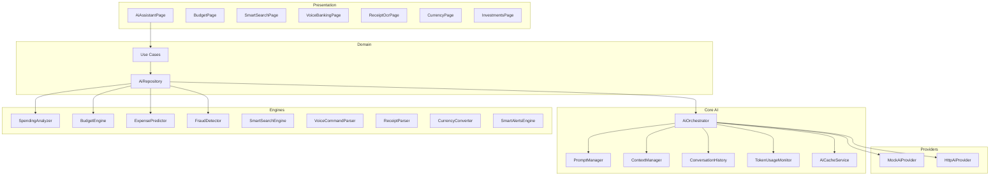

# BankX AI Platform

Next-generation AI capabilities for the BankX digital banking application.

## Architecture



## Features

| Feature | Route | Description |
|---------|-------|-------------|
| AI Assistant | `/ai-assistant` | Natural language chat, navigation hints |
| Spending Analysis | Analytics tab | Category breakdown, trends, savings tips |
| Smart Budget | `/budget` | Monthly budgets, overspending prediction |
| Expense Prediction | Analytics tab | End-of-month balance forecast |
| Smart Alerts | Via `GetSmartAlertsUseCase` | Unusual spending, bills, fraud signals |
| Receipt OCR | `/receipt-ocr` | Scan receipts, auto-categorize |
| Voice Banking | `/voice-banking` | EN/AR voice commands |
| Smart Search | `/smart-search` | NL transaction search |
| Multi-Currency | `/currency` | AED, USD, EUR, SAR, QAR, KWD |
| Investments | `/investments` | Portfolio architecture (stocks, gold, crypto, funds) |
| Fraud Detection | `FraudDetector` engine | Failed logins, rapid transfers, large payments |

## Provider Abstraction

```dart
abstract class AiProvider {
  Future<AiResponse> complete({required List<AiMessage> messages});
  Stream<AiStreamChunk> stream({required List<AiMessage> messages});
  Future<bool> isAvailable();
}
```

| Provider | When used |
|----------|-----------|
| `MockAiProvider` | Default — offline, no API key |
| `HttpAiProvider` | When `BANKX_AI_API_URL` + `BANKX_AI_API_KEY` set |

## Environment Variables

| Variable | Default | Purpose |
|----------|---------|---------|
| `BANKX_ENABLE_AI` | `true` | Master AI feature flag |
| `BANKX_AI_PROVIDER` | `mock` | Provider identifier |
| `BANKX_AI_API_URL` | `""` | Remote AI backend URL |
| `BANKX_AI_API_KEY` | `""` | API key (GitHub Secret) |
| `BANKX_AI_MAX_TOKENS` | `2048` | Per-request token limit |
| `BANKX_AI_CACHE_TTL_MINUTES` | `30` | Response cache TTL |

## Security

- API keys via `String.fromEnvironment` — never hardcoded
- Conversation history encrypted in `flutter_secure_storage`
- Daily token usage limit (50,000 tokens)
- Fraud detection engine for security signals
- AI never requests passwords or PINs (system prompt enforced)

## Performance

- Response caching with TTL (`AiCacheService`)
- Retry with exponential backoff (3 attempts)
- Mock provider fallback when remote fails
- Streaming support via `chatStream()`
- Local engines for offline analysis (no network required)

## Extensibility

### Add a new AI provider

1. Implement `AiProvider` interface
2. Register in `injection.dart`
3. Update `AiOrchestrator._provider` selection logic

### Add a new AI engine

1. Create engine in `lib/core/ai/engines/`
2. Wire through `AiRepositoryImpl`
3. Add use case + route if user-facing

### Connect OpenAI / Gemini / Claude

Set in production `config/env/production.json`:

```json
{
  "BANKX_AI_API_URL": "https://your-ai-proxy.com/v1",
  "BANKX_AI_API_KEY": "from-github-secrets",
  "BANKX_AI_PROVIDER": "openai"
}
```

Backend must expose OpenAI-compatible `/chat/completions` endpoint.

## File Structure

```
lib/core/ai/
├── ai_config.dart
├── ai_orchestrator.dart
├── ai_provider.dart
├── ai_cache_service.dart
├── prompt_manager.dart
├── context_manager.dart
├── conversation_history_service.dart
├── token_usage_monitor.dart
├── models/ai_models.dart
├── engines/
└── providers/

lib/features/ai/
├── domain/
├── data/
└── presentation/
```

## Related Docs

- [ARCHITECTURE.md](ARCHITECTURE.md)
- [ENVIRONMENT.md](ENVIRONMENT.md)
- [AI_ENTERPRISE_REVIEW.md](AI_ENTERPRISE_REVIEW.md)
