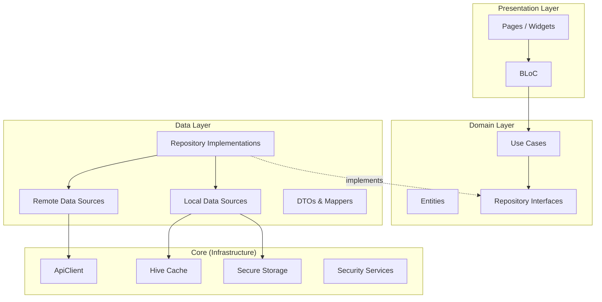
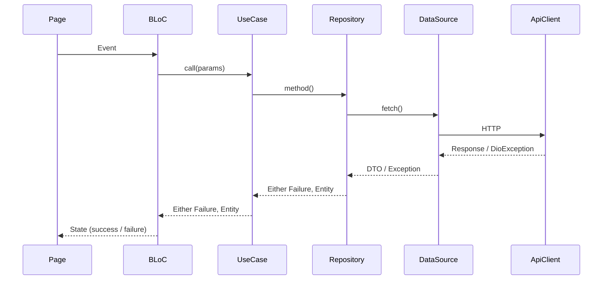
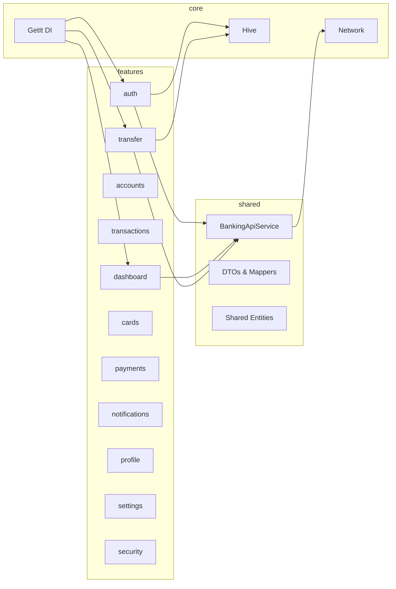
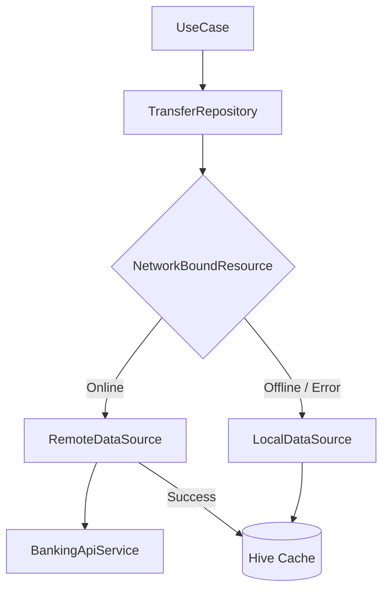
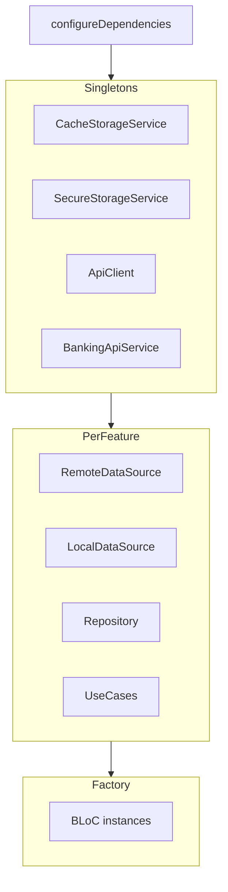
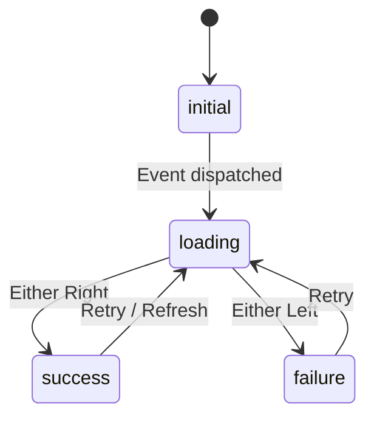
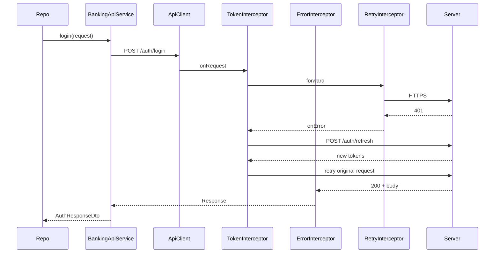
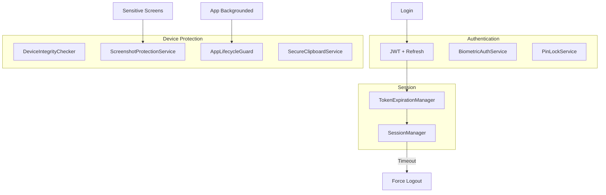
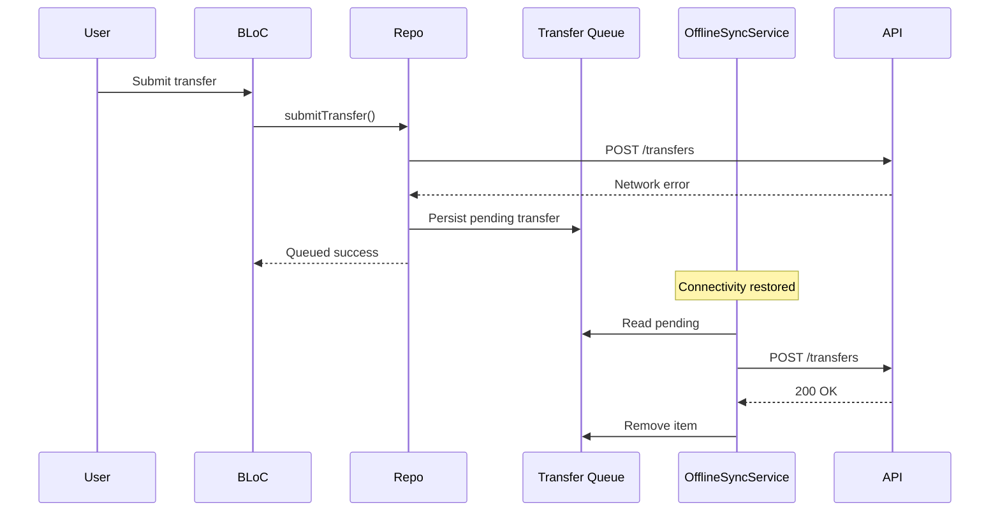

# BankX Architecture

BankX is a production-grade digital banking Flutter application built with **Clean Architecture** and a **feature-first** folder structure.

## Table of Contents

- [Clean Architecture](#clean-architecture)
- [Feature-First Structure](#feature-first-structure)
- [Repository Pattern](#repository-pattern)
- [Dependency Injection](#dependency-injection)
- [State Management](#state-management)
- [Networking Layer](#networking-layer)
- [Local Storage](#local-storage)
- [Security Layer](#security-layer)
- [Navigation](#navigation)
- [Offline Strategy](#offline-strategy)
- [Firebase Integration](#firebase-integration)

---

## Clean Architecture

BankX separates concerns into three concentric layers. Dependencies point inward — outer layers depend on inner abstractions, never the reverse.



### Layer responsibilities

| Layer | Contains | Depends on |
|-------|----------|------------|
| **Presentation** | Pages, widgets, BLoCs, UI state | Domain only |
| **Domain** | Entities, repository contracts, use cases | Nothing external |
| **Data** | Repository impls, data sources, DTOs | Domain + Core |
| **Core** | Network, DI, security, cache, Firebase | Third-party packages |

### Error handling flow



Repositories return `Either<Failure, T>` (via `dartz`). BLoCs map failures to user-visible messages without leaking implementation details.

---

## Feature-First Structure

Each banking capability is a self-contained module under `lib/features/`:

```
features/transfer/
├── data/
│   ├── datasources/
│   │   ├── transfer_remote_data_source.dart
│   │   ├── transfer_remote_data_source_impl.dart
│   │   ├── transfer_local_data_source.dart
│   │   └── transfer_local_data_source_impl.dart
│   ├── repositories/
│   │   └── transfer_repository_impl.dart
│   └── models/ (if feature-specific)
├── domain/
│   ├── entities/
│   ├── repositories/
│   │   └── transfer_repository.dart
│   └── usecases/
│       └── transfer_usecases.dart
└── presentation/
    ├── bloc/
    ├── pages/
    └── widgets/
```



**Benefits:**
- Teams can own features independently
- Changes are localized — transfer changes don't touch cards
- Features can be extracted to packages if needed
- Testability: mock repositories per feature

---

## Repository Pattern

The repository is the single source of truth for a feature's data. It coordinates remote and local sources.



### Read strategy (`NetworkBoundResource`)

1. Emit cached data immediately (if valid TTL)
2. Fetch from remote API
3. Update cache on success
4. Return cached data on network failure

### Write strategy (`RemoteResource`)

Transfers and payments require connectivity. Failed writes are queued in Hive and synced by `OfflineSyncService`.

---

## Dependency Injection

**GetIt** service locator in `lib/core/di/injection.dart`.



Registration order:
1. Core services (storage, network, security, Firebase)
2. Shared API service
3. Per-feature: data sources → repositories → use cases
4. BLoCs registered as `factory` (new instance per screen)

`resetDependencies()` clears GetIt for test isolation.

---

## State Management

**flutter_bloc** with a consistent pattern across all features.



### Conventions

| Concept | Implementation |
|---------|----------------|
| Status enum | `RequestStatus { initial, loading, success, failure }` |
| Events | Feature-specific `*Event` classes |
| States | Feature-specific `*State` with `copyWith` |
| Side effects | `BlocListener` for navigation, snackbars |
| Rebuilds | `BlocSelector`, `BlocBuildWhen` for performance |

Auth-aware routing: `RouterRefreshNotifier` listens to `AuthBloc` and rebuilds `GoRouter` redirects.

---

## Networking Layer



### Components

| Component | File | Role |
|-----------|------|------|
| `ApiClient` | `core/network/api_client.dart` | Dio wrapper, 30s timeouts |
| `TokenInterceptor` | `interceptors/token_interceptor.dart` | Attach JWT, silent refresh on 401 |
| `ErrorInterceptor` | `interceptors/error_interceptor.dart` | Map HTTP → typed exceptions |
| `RetryInterceptor` | `interceptors/retry_interceptor.dart` | Exponential backoff |
| `LoggerInterceptor` | `interceptors/logger_interceptor.dart` | Debug-only request logging |
| `BankingApiService` | `shared/data/api/banking_api_service.dart` | Typed REST methods |
| `AuthRefreshClient` | Same file | Separate Dio for refresh (no recursion) |
| `ApiErrorMapper` | `core/network/api_error_mapper.dart` | Status code → `AppException` |

### Error mapping

| HTTP Status | Exception |
|-------------|-----------|
| 401 | `UnauthorizedException` |
| 403 | `ForbiddenException` |
| 404 | `NotFoundException` |
| 408 | `ApiTimeoutException` |
| 409 | `ConflictException` |
| 422 | `ValidationException` |
| 429 | `TooManyRequestsException` |
| 5xx | `ServerException` |

---

## Local Storage

```mermaid
graph LR
    subgraph "Secure Storage"
        TOK[JWT Tokens]
        PIN[PIN Hash]
        BIO[Biometric Flag]
    end
    subgraph "Hive Cache"
        DASH[Dashboard]
        TXN[Transactions]
        QUEUE[Transfer Queue]
    end
    SS[flutter_secure_storage] --> Secure Storage
    HF[hive_flutter] --> Hive Cache
```

| Store | Technology | Data |
|-------|------------|------|
| **Secure** | `flutter_secure_storage` | Access/refresh tokens, PIN hash, biometric prefs |
| **Cache** | `hive_flutter` | API responses with TTL (`CachePolicy`) |
| **Queue** | Hive box | Pending offline transfers |

Cache keys are namespaced per feature. `CacheStorageService.purgeExpired()` runs on startup.

---

## Security Layer



| Service | Purpose |
|---------|---------|
| `BiometricAuthService` | Fingerprint / Face ID via `local_auth` |
| `PinLockService` | Salted PIN hash in secure storage |
| `SessionManager` | Inactivity timeout → auto logout |
| `TokenExpirationManager` | Proactive JWT expiry checks |
| `ScreenshotProtectionService` | `screen_protector` on card/PIN screens |
| `AppLifecycleGuard` | Privacy blur overlay when backgrounded |
| `SecureClipboardService` | Auto-clear copied account numbers |
| `DeviceIntegrityChecker` | Root/jailbreak detection via `safe_device` |

---

## Navigation

**GoRouter** with `StatefulShellRoute` for bottom navigation:

| Tab | Route | Feature |
|-----|-------|---------|
| Home | `/home` | Dashboard |
| Analytics | `/analytics` | Dashboard |
| Cards | `/cards` | Cards |
| Profile | `/profile` | Profile |

Auth guard: public routes (login, register, onboarding) vs protected shell routes. Redirect logic in `app_router.dart`.

---

## Offline Strategy



---

## Firebase Integration

Optional — enabled via `FIREBASE_CONFIGURED=true` dart-define.

| Service | Package | Role |
|---------|---------|------|
| Analytics | `firebase_analytics` | Login, transfers, payments events |
| Crashlytics | `firebase_crashlytics` | Uncaught exception reporting |
| FCM | `firebase_messaging` | Push notifications + deep links |

Bootstrap: `FirebaseBootstrap.initialize()` in `main.dart` before DI.

---

## Related Documentation

- [API Reference](API.md)
- [Developer Guide](DEVELOPER_GUIDE.md)
- [Features](FEATURES.md)
- [Testing](TESTING.md)
- [Performance](PERFORMANCE.md)
