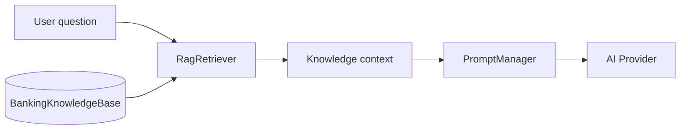

# BankX RAG (Retrieval-Augmented Generation)

Lightweight on-device RAG for the AI assistant — no vector database or external embeddings required.

## How it works

1. User sends a message in **AI Assistant**
2. `RagRetriever` scores knowledge chunks by keyword overlap
3. Top 3 matching chunks are injected as a system message
4. The LLM answers using BankX-specific facts (limits, fees, security)

## Knowledge corpus

`lib/core/ai/rag/banking_knowledge_base.dart` — curated chunks for:

- Transfer limits & fees
- Card freeze
- QR / bill payments
- Budget AI
- Security policy (never ask for PIN)
- Support hours
- Arabic equivalents

## Configuration

| Variable | Default | Purpose |
|----------|---------|---------|
| `BANKX_AI_RAG_ENABLED` | `true` | Toggle RAG injection |

## Extending

1. Add a `KnowledgeChunk` to `BankingKnowledgeBase.chunks`
2. Include `keywords` in EN and AR for retrieval
3. For production scale: replace `RagRetriever` with embedding search + remote KB

## Related

- [AI.md](AI.md)
- [AI_PROXY.md](AI_PROXY.md)
